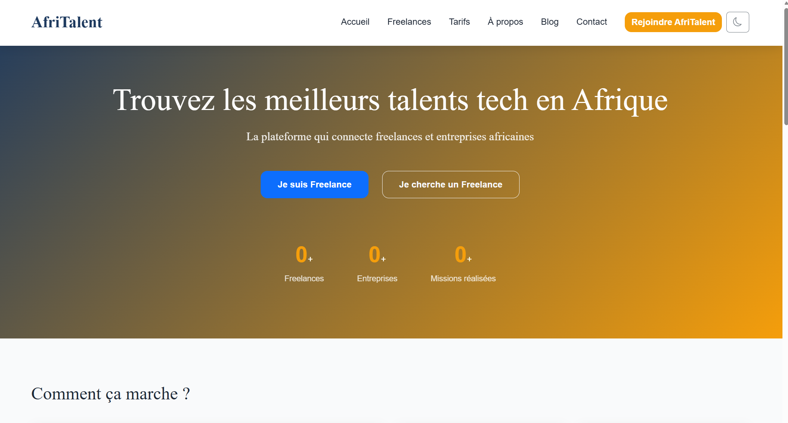

# AfriTalent 🌍

Site vitrine d'une plateforme fictive de mise en relation entre freelances tech et entreprises africaines.

**Étudiante :** Aissatou Fabienne Momar Badji
**Classe :** L1 SEMI
**Projet :** Semestre 2 — Projet individuel

## 📋 Description

AfriTalent est un site web présentant une plateforme imaginaire de freelance dédiée au marché tech africain. Le site met en avant les fonctionnalités de la plateforme, ses tarifs, des profils de freelances fictifs, et incite les visiteurs (freelances comme entreprises) à s'inscrire. La mise en page suit les tendances web 2026 : design épuré, typographie expressive, disposition en Bento Grid, accessibilité et interactivité JavaScript.

## 🛠️ Technologies utilisées

- **HTML5** — structure sémantique et accessible
- **CSS3** — Flexbox, Grid, Bento Grid, variables CSS, animations, responsive design
- **Bootstrap 5** — navbar, cards, carousel, accordion, grille
- **JavaScript (vanilla)** — aucun framework, manipulation du DOM et événements
- **Git & GitHub** — versioning et déploiement via GitHub Pages
- **Google Fonts** — Playfair Display et Poppins
- **Bootstrap Icons** — icônes du site

## ✨ Fonctionnalités principales

- Navigation responsive entre 5 pages (Accueil, Freelances, Tarifs, À propos, Contact)
- Dark mode / Light mode avec sauvegarde dans `localStorage`
- Navbar dynamique qui change de style au scroll
- Compteurs animés au scroll (`IntersectionObserver`)
- Animations en fondu (fade-in) des sections au scroll
- Filtrage dynamique des freelances par catégorie, sans rechargement de page
- Formulaire de contact avec validation JavaScript complète (champs requis, format email par regex, longueur minimale du message)
- Bouton "Retour en haut" avec défilement fluide
- Carousel de témoignages et accordéon FAQ (Bootstrap)
- Année du copyright générée automatiquement en JavaScript

## 📸 Capture d'écran



*(Ajoute ici une capture d'écran de ta page d'accueil)*

## 🚀 Lancer le projet en local

1. Cloner le dépôt :
   ```bash
   git clone https://github.com/AissatouBadji/BADJI-AissatouFabienneMomar-AfriTalent.git
   ```
2. Ouvrir le dossier dans VS Code
3. Installer l'extension **Live Server**
4. Faire un clic droit sur `index.html` → **Open with Live Server**
5. Le site s'ouvre automatiquement dans le navigateur

## 🌐 Voir le site en ligne

Le site est déployé via GitHub Pages :
👉 [https://aissatoubadji.github.io/BADJI-AissatouFabienneMomar-AfriTalent/](https://aissatoubadji.github.io/BADJI-AissatouFabienneMomar-AfriTalent/)

## 📚 Ressources consultées

- [MDN Web Docs](https://developer.mozilla.org/fr/) — référence HTML, CSS, JavaScript
- [Bootstrap 5 Docs](https://getbootstrap.com/docs/5.3/) — composants et grille
- [Google Fonts](https://fonts.google.com/) — polices Playfair Display et Poppins
- [Bootstrap Icons](https://icons.getbootstrap.com/) — icônes du site
- [W3C Validator](https://validator.w3.org/) — validation HTML des 5 pages
- [Pexels](https://www.pexels.com/) — photos libres de droits
- [CSS-Tricks](https://css-tricks.com/) — guides Flexbox et Grid

## 📁 Structure du projet

```
BADJI-AissatouFabienneMomar-AfriTalent/
├── index.html
├── freelances.html
├── tarifs.html
├── about.html
├── contact.html
├── css/
│   └── style.css
├── js/
│   └── main.js
├── images/
├── docs/
│   └── BADJI_AissatouFabienneMomar_Presentation.pptx
├── README.md
└── .gitignore
```

## ⚠️ Note

Ce projet est strictement personnel et a été réalisé dans le cadre d'un projet académique du Semestre 2.
